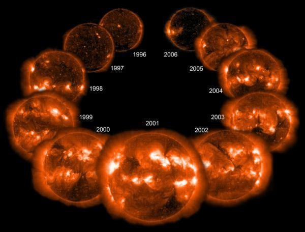
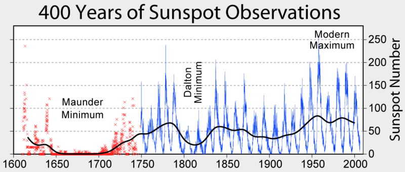

```{r, echo=FALSE, message=FALSE, warning = FALSE}
library(ggplot2)
library(plyr)
library(dplyr)
library(plotly)

```


###Brief Introduction to Dataset:###
The dataset contains the occurrences of sunspots from year 1700 to 1988. In this report as well as the .html file and R Shiny Web App (https://aliciasoh.shinyapps.io/nm3239/), I will be showing the various trends observed in the form of charts and graphs (through R programming) as well as the possible reasons for the trends (through secondary research) and conclusion. The various charts can be viewed in the .html file and R Shiny Web App and the various source code used for R programming can be viewed in the .Rmd file and Shiny Web App R files respectively.


###Q1. Explore	and	analyse	the	data	in	multiple	ways (e.g.:	yearly,	decennially, centennially,	etc.). Show	your analysis. (2%)###


####Yearly:####
```{r, echo=FALSE}
fulldata <- read.csv(file="assignment1_dataset.csv")

p <- plot_ly(fulldata, x = ~year, y = ~sunspots , type="scatter", color=~sunspots, mode="markers") %>%
  layout(title = "Sunspots Yearly",
         xaxis = list(title = "Yearly"),
         yaxis = list(title = "Number Of Sunspots"))

ggplotly(p)

```

####Decennialy:####
```{r, echo=FALSE}
 
firstyear <- fulldata %>% filter(year>=1700 & year<1710)
secondyear <- fulldata %>% filter(year>=1710 & year<1720)
thirdyear <- fulldata %>% filter(year>=1720 & year<1730)
fourthyear <- fulldata %>% filter(year>=1730 & year<1740)
fiveyear <- fulldata %>% filter(year>=1740 & year<1750)
sixyear <- fulldata %>% filter(year>=1750 & year<1760)
sevenyear <- fulldata %>% filter(year>=1760 & year<1770)
eightyear <- fulldata %>% filter(year>=1770 & year<1780)
nineyear <- fulldata %>% filter(year>=1780 & year<1790)
tenyear <- fulldata %>% filter(year>=1790 & year<1800)
elevenyear <- fulldata %>% filter(year>=1800 & year<1810)
twelveyear <- fulldata %>% filter(year>=1810 & year<1820)
thirteenyear <- fulldata %>% filter(year>=1820 & year<1830)
fourteenyear <- fulldata %>% filter(year>=1830 & year<1840)
fithteenyear <- fulldata %>% filter(year>=1840 & year<1850)
sixteenyear <- fulldata %>% filter(year>=1850 & year<1860)
seventeenyear <- fulldata %>% filter(year>=1860 & year<1870)
eighteenyear <- fulldata %>% filter(year>=1870 & year<1880)
nineteenyear <- fulldata %>% filter(year>=1880 & year<1890)
twentyyear <- fulldata %>% filter(year>=1890 & year<1900)
twentyoneyear <- fulldata %>% filter(year>=1900 & year<1910)
twentytwoyear <- fulldata %>% filter(year>=1910 & year<1920)
twentythreeyear <- fulldata %>% filter(year>=1920 & year<1930)
twentyfouryear <- fulldata %>% filter(year>=1930 & year<1940)
twentyfiveyear <- fulldata %>% filter(year>=1940 & year<1950)
twentysixyear <- fulldata %>% filter(year>=1950 & year<1960)
twentysevenyear <- fulldata %>% filter(year>=1960 & year<1970)
twentyeightyear <- fulldata %>% filter(year>=1970 & year<1980)
twentynineyear <- fulldata %>% filter(year>=1980 & year<1990)


a<-c(sum(firstyear$sunspots))
decitable <- data.frame(sunspots = a)
decitable <- rbind(decitable, sum(secondyear$sunspots))
decitable <- rbind(decitable, sum(thirdyear$sunspots))
decitable <- rbind(decitable, sum(fourthyear$sunspots))
decitable <- rbind(decitable, sum(fiveyear$sunspots))
decitable <- rbind(decitable, sum(sixyear$sunspots))
decitable <- rbind(decitable, sum(sevenyear$sunspots))
decitable <- rbind(decitable, sum(eightyear$sunspots))
decitable <- rbind(decitable, sum(nineyear$sunspots))
decitable <- rbind(decitable, sum(tenyear$sunspots))
decitable <- rbind(decitable, sum(elevenyear$sunspots))
decitable <- rbind(decitable, sum(twelveyear$sunspots))
decitable <- rbind(decitable, sum(thirteenyear$sunspots))
decitable <- rbind(decitable, sum(fourteenyear$sunspots))
decitable <- rbind(decitable, sum(fithteenyear$sunspots))
decitable <- rbind(decitable, sum(sixteenyear$sunspots))
decitable <- rbind(decitable, sum(seventeenyear$sunspots))
decitable <- rbind(decitable, sum(eighteenyear$sunspots))
decitable <- rbind(decitable, sum(nineteenyear$sunspots))
decitable <- rbind(decitable, sum(twentyyear$sunspots))
decitable <- rbind(decitable, sum(twentyoneyear$sunspots))
decitable <- rbind(decitable, sum(twentytwoyear$sunspots))
decitable <- rbind(decitable, sum(twentythreeyear$sunspots))
decitable <- rbind(decitable, sum(twentyfouryear$sunspots))
decitable <- rbind(decitable, sum(twentyfiveyear$sunspots))
decitable <- rbind(decitable, sum(twentysixyear$sunspots))
decitable <- rbind(decitable, sum(twentysevenyear$sunspots))
decitable <- rbind(decitable, sum(twentyeightyear$sunspots))
decitable <- rbind(decitable, sum(twentynineyear$sunspots))

decennial <- c('1700-1709', '1710-1719', '1720-1729', '1730-1739', '1740-1749', '1750-1759', '1760-1769', '1770-1779', '1780-1789', '1790-1799', '1800-1809', '1810-1819', '1920-1929', '1830-1839', '1840-1849', '1850-1859', '1860-1869', '1870-1879', '1880-1889', '1890-1899', '1900-1909', '1910-1919', '1920-1929', '1930-1939', '1940-1949', '1950-1959', '1960-1969', '1970-1979', '1980-1989')

decitable$decennial<-decennial
decitable<- data.frame(decitable)


p <- plot_ly(decitable, x = ~decennial, y = ~sunspots, type = 'bar',
        marker = list(color = ~sunspots,
                      line = list(color = ~sunspots,
                                  width = 1.5))) %>%
  layout(title = "Sunspots Decennially",
         xaxis = list(title = "Decennial"),
         yaxis = list(title = "Number Of Sunspots"))

ggplotly(p)


```


####Centennially:####
```{r, echo=FALSE}
 
cfirstyear <- fulldata %>% filter(year>=1700 & year<1800)
csecondyear <- fulldata %>% filter(year>=1800 & year<1900)
cthirdyear <- fulldata %>% filter(year>=1900 & year<2000)


ca<-c(sum(cfirstyear$sunspots))
centetable <- data.frame(sunspots = a)
centetable <- rbind(centetable, sum(csecondyear$sunspots))
centetable <- rbind(centetable, sum(cthirdyear$sunspots))


centennial <- c('1700-1799', '1800-1899', '1900-1999')

centetable$centennial<-centennial
centetable<- data.frame(centetable)


p <- plot_ly(centetable, x = ~centennial, y = ~sunspots, type = 'bar',
        marker = list(color = 'rgb(55, 83, 109)',
                      line = list(color = 'rgb(55, 83, 109)',
                                  width = 1.5))) %>%
  layout(title = "Sunspots Centennially",
         xaxis = list(title = "Centennial"),
         yaxis = list(title = "Number Of Sunspots"))

ggplotly(p)

```

####Analysis:####
From the yearly chart, we can see that the sunspots fluctuates throughout the year. There is no regular pattern but once the sunspot reaches it's peak, it will drop/ decrease and then it will start to increase again before reaching another peak and then decrease again. The most number of sunspot peaks during year 1957 at 190.2 and the lowest number of sunspot are during year 1711, 1712 and 1810 where there are 0 sunspots.

Similarly from the decenially chart, we can see that the sunspots fluctuates as well throughout. There is no pattern. However, the difference between the yearly and the decenially chart is that the fluctuation is more intense in the decenially chart. The most number of sunspot peaks during year 1950-1959 at 916.8 and the lowest number of sunspot is during year 1810-1819 at 208.8.

Lastly, for the centennially chart, we can see that the number of sunpots experiences an increase trend from year 1700 to 1988. There is a sharp increase from centennial 1700-1799 (at 216.0) to 1800-1899 (at 4255.5) but from centennial 1800-1899 to 1900-1999 (at 5224.5), although there is an increase, the extend of increase is not as large. The number of sunspots reaches its peak during centennial (1900-1999) at 5224.5 and the lowest is during (1700-1799) at 216.0.


###Q2. Calculate	and	report the	most appropriate descriptive statistics. (2%)###

####Statistics:####
```{r, echo=FALSE}

dplyr::summarise(fulldata, Average_Sunspots = mean(sunspots), Lowest_Sunspots = min(sunspots), Highest_Sunspots = max(sunspots), Median_Sunspots = median(sunspots))
dplyr::summarise(fulldata, SD_Sunspots = sd(sunspots), Variance_Sunspots = var(sunspots))

```

As seen from the calculations above, the mean number of sunspots from year 1700 to 1988 is 48.61349. The most number of sunspot is 190.2 while the lowest is 0. 

The standard deviation is 39.4741 and this value represents how much the number of sunspots per year differ from its mean value. It has a rather high standard deviation and thus, we can conclude that the number of sunspots per year deviates quick a large amount from its mean value per year. This can be clearly seen from Q1 charts where the number of sunspots per year fluctuates immensely.

###Q3. Visualize your data with	basic	graphs:	select the most suitable chart type and plot	your graphs accordingly (e.g.: bar, column, line, scatter, etc.) (2%)###

####Bar chart:####
```{r, echo=FALSE}

p <- plot_ly(fulldata, x = ~year, y = ~sunspots, type = 'bar',
        marker = list(color = ~sunspots,
                      line = list(color = ~sunspots,
                                  width = 1.5))) %>%
  layout(title = "Sunspots Yearly",
         xaxis = list(title = "Yearly"),
         yaxis = list(title = "Number Of Sunspots"))

ggplotly(p)

```

####Line chart:####
```{r, echo=FALSE}

p <- plot_ly(fulldata, x = ~year, y = ~sunspots, type = 'scatter', mode = 'lines') %>%
  layout(title = "Sunspots Yearly",
         xaxis = list(title = "Yearly"),
         yaxis = list(title = "Number Of Sunspots"))

ggplotly(p)

```

####Scatter plot:####
```{r, echo=FALSE}

p <- plot_ly(fulldata, x = ~year, y = ~sunspots , type="scatter", color=~sunspots, mode="markers") %>%
  layout(title = "Sunspots Yearly",
         xaxis = list(title = "Yearly"),
         yaxis = list(title = "Number Of Sunspots"))

ggplotly(p)

```

####Scatter plot & Line Chart:####
```{r, echo=FALSE, message=FALSE, warning = FALSE}

p <- plot_ly(fulldata, x = ~year, y = ~sunspots, type = 'scatter', mode = 'lines',
        marker = list(color = ~sunspots,
                      line = list(color = ~sunspots,
                                  width = 1.5))) %>%
  layout(title = "Sunspots Yearly",
         xaxis = list(title = "Yearly"),
         yaxis = list(title = "Number Of Sunspots"))

ggplotly(p)

```


###4. Tell a story based on	your analysis: (6%)###

####What are your overall conclusions:####
A sunspot is a spot or patch that appears from time to time on the sun's surface, appearing dark by contrast with its surroundings. According to the charts above, I can conclude that the number of sunspots has increased throughout the years. Although there are a series of fluctuations (where it decreases after reaching a peak), the peak reaches a new maximum every 11 years.

####What are your recommendations/ predictions:####
Recommendations: In order to get a more accurate recording of the number of sunspots yearly, perhaps different sources of sunspots data could be combined into one. In addition, together with the sunspots data, other forms of recorded solar activity could be used to make the observations more credible and accurate.

Predictions: I would predict that the average number of sunspots would increase in the future, reaching a new maximum peak every 11 years. The pattern of the number of sunspots throughout the year in the future would still be the same, where it fluctuates by reaching a peak and then decreasing and then increasing again.

####What are some	new	things that	you	learnt from	the	dataset? What surprised	you? What inspired you:####
What surprised me was that the number of sunspots fluctuated so greatly across the year. I was expecting an increase in number of sunspots through the years. However, the charts and graphs above prove otherwise. What inspired me was to find out the definition of sunspots and how it is formed. I was also interested to know about the impacts of the number of sunpots would cause to Earth (e.g. Would it lead to a colder average temperature if there are fewer sunspots? or Would it aggrevate global warming if there are more sunspots?)

####Did	you	notice any hidden	information	or patterns	from the data and/or graphs?:####
I noticed that the pattern of the data forms a similar pattern to how a heart beats. It goes up and then once it reaches its peak, it goes down again and then the cycle repeats. However, unlike how a normal heart beats where it beats at a constant rate continuously (given the same circumstances), the graph of the number of sunspots fluctuates irregularly. It reaches a new maximum peak every 11 years or so as well as a higher minimum value every single time.

In addition, another hidden information would be from the centennial graph from Q1 where there is a sharp increase in sunpots from centennial 1700-1799 (at 216.0) to 1800-1899 (at 4255.5). Perhaps a certain event occured during this period. 

####Search for external	sources	on the WWW for insights and	other	data	sources	(scientific papers,	news articles, blogs,	etc).:####



As according to Scientific America, it states that the number of sunspots goes through a cycles where it reaches a peak, known as the so-called Solar Maximum, every 11 years thereabouts and then it decreases again before going through the same cycle. It has been observed that sunspot activity has doubled in the last century ahd this has resulted in the sun glowing brighter by about 0.1 percent now as compared to 100 years ago. Sunspots are assocated with solar flares and coronal mass ejections and these can cause Earth's temperature to increase. (Scientific American, 2017)

As seen in the picture below, from year 1645 to 1715, the number of sunspot seemed to disappear. This is known as the Maunder Minimum. During this period, Northern Europe and other parts of the world entered into a “Little Ice Age” where long period of cool summers and long winters occured. 

Following this period is called the Dalton Minimum. This occurred from 1795-1825. It is also a period of cooler climate, similar to the Maunder Minimum. However, there was an eruption of the Tambora volcano in 1816 and this made some contribution to an increase in sunspot. (Ventrudo, 2009)



To answer the question of whether sunspot has any correlation to Earth's temperature or climate or not, here are the explanations:

According to One-Minute Astronomer, the sun do get warmer with increasing number of sunspots. Although sunspots are cooler, they are accompanied by hotter and brighter patches called faculae. These causes the overall brightness of the sun to increase by 0.1% at visible wavelengths, and produce more at ultraviolet wavelengths.

Therefore, due to an increase in sunspots, increase in solar activity and human activities on Earth, this results in a general increase of Earth's temperature throughout the years. (Ventrudo, 2009)

####References####

Scientific American. (2017). The Role of Sunspots and Solar Winds in Climate Change. Retrieved from Scientific American: https://www.scientificamerican.com/article/sun-spots-and-climate-change/

Ventrudo, B. (2009, September 24). Do Sunspots Cause Global Warming? Retrieved from One Minute Astronomer: http://oneminuteastronomer.com/1054/sunspots-global-warming/

B. (2009, September 24). Images of the sun from a space satellite, showing the increase and decrease in activity from 1996 to 2006 [Digital image]. Retrieved February 15, 2017, from http://astronomer.wpengine.netdna-cdn.com/wp-content/uploads/2009/09/sunspots_recent_history.jpg

B. (2009, September 24). The sunspot cycles since 1600, showing the Maunder and Dalton minima [Digital image]. Retrieved February 15, 2017, from http://astronomer.wpengine.netdna-cdn.com/wp-content/uploads/2009/09/Sunspot-Cycle.png


