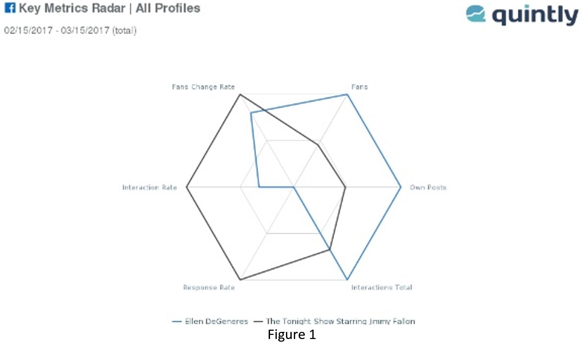

```{r, echo=FALSE, message=FALSE, warning = FALSE}
library(ggplot2)
library(plyr)
library(dplyr)
library(plotly)
library(readxl)

```
<br>

##Ellen Degeneres or Jimmy Fallon?##

<br>

####1. Select two competing fan pages in Facebook that are similar in nature.####
Ellentv (The Ellen DeGeneres Show) & FallonTonight (The Tonight Show Starring Jimmy Fallon)

####Brief Introduction of Dataset####
Using Netlytic (Netlytic, 2017), Quintly (Quintly, 2017), Facebook Graph API (Facebook For Developers, 2017) as well as data from FanPageKarma.com (FanPageKarma, 2017) to collect publicly available Facebook data (posts, photos, comments, likes, etc.) from Ellentv and FallonTonight Facebook page to conduct analysis for the various questions below and provide recommendations for users on the two stand-up comedy shows.

The raw data that are extracted from the various tools above are included in submission file as well as in the Word Document Report.Grep commands and results are included in Appendix B in the Word Document Report.

The raw data collected (from the various tools above) are cleaned and reformatted and re-exported into Excel (.xlsx) format and saved as ellentxt.xlsx and fallontxt.xlsx in the R project folder. These data are used to create the charts (as shown below) in R studio.

####2. Use Netlytic (collect data at least for 2 hours) and/or Facebook Graph API to collect publicly available Facebook data from these pages (posts, photos, comments, likes, etc.). (1%)####
(Refer to NM3239 Word Document Report for the data collected)

Netlytic .csv datas: (Collected for 3 days - 15th March to 17th March 2017)

Quintly .pdf and .jpeg datas: (Collected from 15th February to 15th March 2017)

Facebook Graph API .csv datas: 

https://graph.facebook.com/v2.8/ellentv/posts/?fields=message,link,permalink_url,created_time,type,name,id,comments.limit(5).summary(true),shares,likes.limit(0).summary(true),reactions.limit(0).summary(true)&limit=100&access_token=EAACEdEose0cBAHvf2Bt85S9AcGGjCbVMAjmVELSLpqWAX87MbVWQvPKcerGMMB7E8RINLxBhCRP9CsZBeGjV3K7ap24Uj288FfRoMyh9mM5JfVlIrX2pZBedSDEDrJqZBEZCcUii82LWGTCabhkbzAVRQU4YYEfOUJjd1ZA7fEoyn66CdhhBw 

https://graph.facebook.com/v2.8/FallonTonight/posts/?fields=message,link,permalink_url,created_time,type,name,id,comments.limit(5).summary(true),shares,likes.limit(0).summary(true),reactions.limit(0).summary(true)&limit=100&access_token=EAACEdEose0cBAHvf2Bt85S9AcGGjCbVMAjmVELSLpqWAX87MbVWQvPKcerGMMB7E8RINLxBhCRP9CsZBeGjV3K7ap24Uj288FfRoMyh9mM5JfVlIrX2pZBedSDEDrJqZBEZCcUii82LWGTCabhkbzAVRQU4YYEfOUJjd1ZA7fEoyn66CdhhBw 

####Who uploads photos and posts more frequently?####
Based on the key metrics data image (Refer to Figure 1) from Quintly, it shows that Ellen Show posts more own posts (133 posts) more frequently than compared to The Tonight Show (64 posts). Based on the pie chart image (Refer to Figure 2) from Netlytic, it shows that Ellen Show posts more own posts (30 posts) more frequently than compared to The Tonight Show (7 posts). Drilling down to the different kinds of posts, as according to Netlytic, Ellentv has more photo (10 posts) as compared to FallonTonight (0 photo posts). However, both Ellentv and FallonTonight has the same number of status/ text posts (1 post).




<br>

Based on the histogram below (created with R and Plotly and the cleaned data from Netlytic), it shows that Ellen Show posts more own posts (30 posts) more frequently than compared to The Tonight Show (7 posts). Drilling down to the different kinds of posts, as according to the pie chart, Ellentv has more photo (10 posts) as compared to FallonTonight (0 photo posts). However, both Ellentv and FallonTonight has the same number of status/ text posts (1 post).
<br>
<br>
Below shows a histogram showing the number of posts by each each author in Ellentv.
```{r, echo=FALSE}

fulldata <- read_excel("ellentxt.xlsx")
occurence <- table(fulldata$author)

p <- plot_ly(fulldata, x = ~author, type = "histogram", marker = list(color = 'rgb(144,103,167)')) %>%
  layout(title = "Number of Posts by Author",
         xaxis = list(title = "Author"),
         yaxis = list(title = "Number Of Posts"))

ggplotly(p)
```

<br>
Below shows a histogram showing the number of posts by each each author in FallonTonight.
```{r, echo=FALSE}

fulldatafallon <- read_excel("fallontxt.xlsx")
occurence <- table(fulldatafallon$author)

p <- plot_ly(fulldatafallon, x = ~author, type = "histogram", marker = list(color = 'rgb(114,147,203)')) %>%
  layout(title = "Number of Posts by Author",
         xaxis = list(title = "Author"),
         yaxis = list(title = "Number Of Posts"))

ggplotly(p)

```

<br>
Below shows a donut chart comapring the number of photo posts by Ellentv and FallonTonight.
```{r, echo=FALSE}

fulldatafallon <- read_excel("fallontxt.xlsx")

ellenimages<-
  fulldata %>%
  filter(type == 'photo', author=='Ellen DeGeneres')

fallonimages<-
  fulldatafallon %>%
  filter(type == 'photo', author=='The Tonight Show Starring Jimmy Fallon')

a<-c('Ellentv', 'FallonTonight')
imagecompare <- data.frame(Author = a)
countsimage<-c('10', '0')
imagecompare$Counts<-countsimage

p <- plot_ly(imagecompare, labels = ~Author, values = ~Counts) %>%
 
  add_pie(hole = 0.6) %>%
layout(title = 'Number of photo posts for each authors',
         xaxis = list(showgrid = FALSE, zeroline = FALSE, showticklabels = FALSE),
         yaxis = list(showgrid = FALSE, zeroline = FALSE, showticklabels = FALSE))

ggplotly(p)
imagecompare
```

<br>
Below shows a donut chart comapring the number of status/text posts by Ellentv and FallonTonight.
```{r, echo=FALSE}

ellenstatus<-
  fulldata %>%
  filter(type == 'status', author=='Ellen DeGeneres')

fallonstatus<-
  fulldatafallon %>%
  filter(type == 'status', author=='The Tonight Show Starring Jimmy Fallon')

a<-c('Ellentv', 'FallonTonight')
statuscompare <- data.frame(Author = a)
countsstatus<-c('1', '1')
statuscompare$Counts<-countsstatus

p <- plot_ly(statuscompare, labels = ~Author, values = ~Counts) %>%
   add_pie(hole = 0.6) %>%
layout(title = 'Number of status posts for each authors',
         xaxis = list(showgrid = FALSE, zeroline = FALSE, showticklabels = FALSE),
         yaxis = list(showgrid = FALSE, zeroline = FALSE, showticklabels = FALSE))


ggplotly(p)
statuscompare

```

####The average numbers of likes (or reactions Like, Love, Haha, Wow, Sad, Angry), shares and comments for different posts (photos, videos, and links).####
As according to FanPageKarma (FanPageKarma, 2017), the total average number of likes, shares and comments for all posts is as stated below (Refer to Figure 3). Upon further analysis (Refer to Figure 4), the total average number of reactions for Ellentv (left) for videos is 60,586, 53,472 for pictures, 13,652 for links and 2,097 for statuses. As for FallonTonight (right), the total average number of reactions for videos is 103,250, 19,313 for pictures, 18,036 for links and 2,955 for statuses. 


<br>

Below is an interactive version of the visualisation as according to the data obtained from FanPageKarma (FanPageKarma, 2017). As seen below, it shwos the number of different interactions for Ellentv. 
```{r, echo=FALSE}

a <-c('Likes', 'Comments', 'Shares', 'Love', 'Wow', 'Haha', 'Sad', 'Angry')
interactive <- data.frame(Interactions= a)
ellen <-c('32000', '3000', '9800', '6500', '617', '2200', '8.2', '7.5')
fallon<-c('22000', '1800', '8400', '3700', '79', '4400', '4.2', '13' )

interactive$Ellentv<-ellen
interactive$FallonTonight<-fallon

p <- plot_ly(interactive, labels = ~Interactions, values = ~Ellentv, type = 'pie') %>%
layout(title = 'Number of different interactions for Ellentv',
         xaxis = list(showgrid = FALSE, zeroline = FALSE, showticklabels = FALSE),
         yaxis = list(showgrid = FALSE, zeroline = FALSE, showticklabels = FALSE))


ggplotly(p)
```

As seen below, it shwos the number of different interactions for FallonTonight.

```{r, echo=FALSE}

p <- plot_ly(interactive, labels = ~Interactions, values = ~FallonTonight, type = 'pie') %>%
layout(title = 'Number of different interactions for FallonTonight',
         xaxis = list(showgrid = FALSE, zeroline = FALSE, showticklabels = FALSE),
         yaxis = list(showgrid = FALSE, zeroline = FALSE, showticklabels = FALSE))


ggplotly(p)

```


####Analyze the comments stream to gain insights.#### 
Based on the bar chart image (Refer to Figure 5) from Netlytic, it shows that the comment stream from Ellen Show are more towards having a positive outlook on life, love, world and happiness related texts than compared to The Tonight Show. On the other hand, the comment stream from FallonTonight are more towards celebrities such as Jimmy Fallon himself as well as about the show. Moreover, the topics from Ellentv seems to be more female oriented due to the high presence of the text 'women'. On the other hand, the topics from Fallontv seem to be more focused on the show itself and does not show any preferences towards females nor males.


<br>

Below is an interactive version of the visualisation as according to the data obtained from Netlytic. As seen below, it shows the occurrences of different keywords in the comment stream for Ellentv. 

```{r, echo=FALSE}


a <-c('Love', 'Show', 'People', 'World', 'Women', 'Life', 'Degeneres', 'Make', 'Good', 'Happy')
wordsEllen <- data.frame(Keywords = a)
value <-c(185, 99, 79, 56, 51, 49, 43, 41, 40, 40)
wordsEllen$Occurences<-value

p <- plot_ly(wordsEllen, x = ~Keywords, y = ~Occurences, type = 'bar',
        marker = list(color = 'rgb(0,0,100)')) %>%
  layout(title = "Number of occurrences for each keywords for Ellentv",
         xaxis = list(title = "Keywords"),
         yaxis = list(title = "Number Of Occurrences"))


ggplotly(p)

```

<br>
As seen below, it shows the occurrences of different keywords in the comment stream for FallonTonight. 

```{r, echo=FALSE}


a <-c('Jimmy', 'Show', 'Love', 'World', 'Watch', 'Mayte', 'Garcia', 'Fallon', 'Back', 'Date')
wordsEllen <- data.frame(Keywords = a)
value <-c(64, 54, 37, 27, 22, 20, 17, 16, 16, 16)
wordsEllen$Occurences<-value

p <- plot_ly(wordsEllen, x = ~Keywords, y = ~Occurences, type = 'bar',
        marker = list(color = 'rgb(0,100,80)')) %>%
  layout(title = "Number of occurrences for each keyword for FallonTonight",
         xaxis = list(title = "Keywords"),
         yaxis = list(title = "Number Of Occurrences"))


ggplotly(p)

```

####What similarities and differences can you identify between fans of these two selected pages?#### 
Based on the chain network diagrams (who reply to whom) (Refer to Figure 6) from Netlytic, it shows that there is a clear difference between the fans from Ellentv and FallonTonight. For Ellentv, majority of the fans reply to Ellentv on the fan page and there is a clear interaction between fans and Ellentv. On the other hand, majority of the fans on FallonTonight fan page do not reply to FallonTonight on the fan page and there is only a small interaction between fans and FallonTonight. Thus, the difference is that, the fans from Ellentv are more interactive and participative than compared to FallonTonight.


####What are the most common topics being discussed?####
Based on the chart image (Refer to Figure 7) from Netlytic, it shows that the most common topics discussed constantly from Ellen Show are about love, the show and (kind) people related texts. On the other hand, the common topics discussed from FallonTonight are towards celebrities such as Jimmy Fallon himself as well as about the show.


####Can you tell if fans are particularly happy or upset about anything?#### 
Based on the treemap chart image (Refer to Figure 8) from Netlytic, it shows that fans from both Ellen Show and The Tonight Show has both good and bad feelings. As for Ellentv and FallonTonight, the positive feelings are referring to how 'funny', 'hilarious' and 'silly' the show is and evoking 'good' and 'happy' feelings towards fans. Upon further analysis of the negative feelings that fans from Ellentv mentioned, they are referring to how 'Ellen show cheers them up on a bad day', 'cheeks hurt from laughing so much'. However, as for FallonTonight, the negative feelings are referring to how the fans are 'tired of watching the same games' that Jimmy Fallon has on his show and the fans suggests that Jimmy Fallon should add in new and funny elements into the show. There are also several misinterpretations of the negative feelings. For example, one of the fans mentioned that they are 'tired and angry' of Donald Trump speaking negatively of Jimmy Fallon and causing political drama.


####Can you find anything surprising or trending?####
As according to the data from Quintly (Refer to Figure 9), there are very intense and high spikes (increase) in interaction rate for FallonTonight on 17th February, 27th February and 13th March. This is similarly followed by a sharp spike (increase) in fan change rate on 18th February, 28th February and 14th March (1 day after the high interaction rate). Upon further analysis of what caused these high interactions rate/ sudden increase in fan change rates, I noticed that on the day when there are high interaction rates, FallonTonight posted videos/ photos that fans are interested in. For example, on the 17th February, FallonTonight posted a video clip of the show featuring Robert Irwin (the late Steve Irwin's son). As these posts catches fans' and the public's interest, it resulted in high interaction rates and following a change (increase) in fans change rates.


####Develop an emotional level indicator####
(Refer to Appendix B in the report for grep commands and results on Cygwin)

As according to the table (Refer to report) and the bar chart (Refer to Figure 10), it shows that Ellentv has the most number of occurrences of 'happy' related words (98 counts) followed by 'sad' (45 counts) and 'surprised' (12 counts). As mentioned earlier, the 'sad' related words are misinterpreted and the actual meaning of the 'sad' keyword is referring to how the show (Ellentv) lights up the fans/ viewers' day. There are occurrences of 'fear' and 'angry' related words but they appear in small amounts (8 and 4 counts respectively). Similarly, FallonTonight has the most number of occurrences for 'happy' related words (20 counts) and then followed by 'disgust' and 'angry' (2 counts for both) but they appear in small amounts as well. Thus, these two stand-up comedy shows are effective in evoking a 'happy' spirit/ emotion to their fans/ viewers as the number of occurrences of 'happy' related words trumps the words that evoke negative feelings. Both shows are successful in putting negative feelings such as 'angry' or 'disgust' aside. However, Ellentv has more a lot more 'happy' related word counts than compared to FallonTonight. As such, it is possible to conclude that the fans/ viewers experience more happy thoughts or positive feelings than compared to FallonTonight fans.


<br>

Below is an interactive version of the visualisation. As seen below, it shows the emotional level indicator for both Ellentv and FallonTonight Facebook page. 

```{r, echo=FALSE}

a <-c('Angry', 'Fear', 'Surprise', 'Disgust', 'Happy', 'Sad')
emotional <- data.frame(Keywords = a)
valueEllen <-c(4, 8, 12, 0, 98, 45)
valueFallon <-c(2, 0, 0, 0, 2, 20)

emotional$Ellentv<-valueEllen
emotional$FallonTonight<-valueFallon

p <- plot_ly(emotional, x = ~Keywords, y = ~Ellentv, type = 'bar', name = 'Ellentv', marker = list(color = 'rgb(211,94,96)')) %>%

  add_trace(y = ~FallonTonight, name = 'FallonTonight', marker = list(color = 'rgb(144,103,167)')) %>%
  
  layout(title = "Emotional level indicator (Number of occurrences of keywords)",
         xaxis = list(title = "Stand up comedy shows"),
         yaxis = list(title = "Number Of Occurrences"))

ggplotly(p)

```


####What are your overall conclusions? ####
From the data and analyses above, I can conclude that both stand-up comedy TV shows are indeed entertainment shows that is capable of lighting up someone's life or bad day. Perhaps this is why such comedy shows are so addictive as fans get attached to these shows for their source of happiness or entertainment.
I can also conclude that Ellen Show is catered more towards people who are seeking for happiness, having a positive outlook on life, needing a little boost/ positive thought to help people to get through the day. In addition, The Ellen Show is known to be friendly towards female audience. As for The Tonight Show, it is catered more towards people who are interested to see celebrity interviews or fun and games (e.g. Dance Battle, Lip Sync Battle) with celebrities. 

####What are your recommendations or predictions? ####
I would recommend The Ellen Show for female audiences and viewers who are interested to know more about their celebrities to watch The Tonight Show. I predict that Ellentv will experience a continuous steady increase in fans as well as interaction rate on the Facebook page. As for FallonTonight, the Facebook page will similarly experience a steady and continuous increase in fans as well as interaction rate and it will experience a sudden spike (increase) when FallonTonight posts interesting videos that entices viewers/ fans to a great extent. 

####What are some new things that you learnt from the dataset? What surprised you? What inspired you? ####
I have learnt many things from the dataset and through the analyses. I have learnt that it is important for these Entertainment shows to cater to its audience (e.g. by having interesting videos that entices people or delving into the popular topics at the current moment) in order for them to compete with their competitors. I have also learnt that it is important to keep changing, updating and not be stagnant with the programmes of the show as this would make the show 'boring' or cause the fans to be 'tired' of the same programmes. What surprised me was that, although The Ellen Show was catered more towards female audience, upon deeper analysis into the comments section, there are also male fans/ viewers that actively participate and interact in the Facebook fan page as well as support the show. I believe that happiness helps to bring out the best in oneself as it allows the mind to nurture positive qualities and as such, I feel inspired to spread these entertainment shows to anyone who constantly face trouble in trying to stay positive in life or are currently feeling down as I understand that these shows are capable of bringing light to someone's life. 

####Did you notice any hidden information or patterns from the comparisons/graphs? ####
I noticed that high spikes (increase) levels in interaction rate (e.g. on 17th February, 27th February and 13th March) is followed by a sharp spike (increase) in fan change rate (e.g. on 18th February, 28th February and 14th March). This change (increase) in the number of fans is observed 1 day after the high interaction rate. I also noticed that the number of fans/ likes on the Facebook page correlates to the amount of interactions on the posts on the Facebook page. For example, with reference to Figure 3, Ellentv has double the number of fans as compared to FallonTonight. Similarly, the interactions (e.g. likes, reactions, shares) in Ellentv are double the number as compared to FallonTonight.

####Search for external sources on the WWW for insights and other data sources. ####
As mentioned earlier, through analysis, Ellentv would be suitable for women and this is supported by The Hollywood Reporter where it states that the majority of The Ellen Show target demographic consists of women (Guthrie, 2016). Moreover, the aim of The Ellen Show, as reported by Los Angeles Times, is to make people feel good and to spread happiness (Los Angeles Times, 2013). This supports the analyses and findings of the social media data collected from the Facebook page (e.g. that the show makes fans feel positive emotions such as 'happy', 'love' and 'kind'). As for FallonTonight, through analyses, the show is mainly catered towards celebrities' interviews and games. This is supported by external sources where it states that The Tonight Show stars Jimmy Fallon who will start the show with an opening monologue and then move on to interviewing celebrities. The show has many recurring segments and games (e.g. Lip Sync Battles) that are played with the various celebrity guests (Wikipedia, 2017).

####What challenges arose while working with social media data?####
Firstly, there is a large amount of spams or irrelevant texts in the data. For example, in the comments section of the posts in Ellentv, users would post irrelevant comments trying to advertise or advocate certain information that is not related to Ellentv at all. This would make the analysis of data skewed as there are irrelevant data present. If such data are present at large quantities, it could make the analysis of the data inaccurate. Secondly, there are many different social media platforms today and in order to have a bigger and more accurate analysis, collecting data from all the major social media platforms (e.g. Facebook, Twitter, Instagram, Youtube) would be beneficial. In addition, these different social media platforms allow users to perform different actions. For example, Twitter allows users to retweet and tweet. However, these actions are not possible for Instagram. As such, these different actions has to be interpreted differently.

####References:####
Facebook For Developers. (2017). Facebook For Developers. Retrieved from Facebook For Developers: https://developers.facebook.com/

FanPageKarma. (2017). FanPageKarma. Retrieved from FanPageKarma: http://www.fanpagekarma.com/

Guthrie, M. (2016, April 1). 'The Ellen DeGeneres Show' Renewed Through 2020. Retrieved from The Hollywood Reporter: http://www.hollywoodreporter.com/news/ellen-degeneres-show-renewed-2020-851889

Los Angeles Times. (2013, April 5). For Ellen DeGeneres, things are going along nicely. Retrieved from Los Angeles Times: http://www.latimes.com/entertainment/envelope/cotown/la-et-ct-for-ellen-degeneres-things-are-going-along-nicely-20130405-dto-htmlstory.html

Netlytic. (2017). Netlytic. Retrieved from Netlytic: https://netlytic.org/

Quintly. (2017). Quintly. Retrieved from Quintly: https://www.quintly.com/

Wikipedia. (2017, March 18). The Tonight Show Starring Jimmy Fallon. Retrieved from Wikipedia: https://en.wikipedia.org/wiki/The_Tonight_Show_Starring_Jimmy_Fallon
